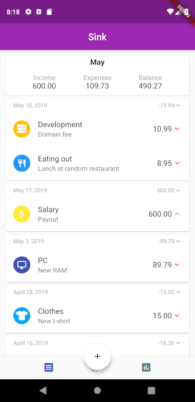
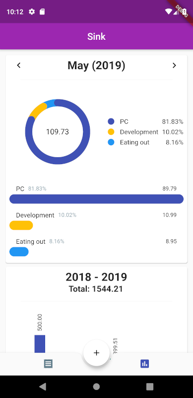
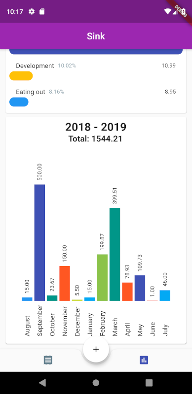

# Sink 
**Sink** is an app that allows you to track your income and expenses.

## Current Status

- [ ] Usable
- [x] Visually bearable
- [ ] Unusable

## Screenshots
### Registration & Sign In
 

### Entry List

### Breakdowns
 

## Local App Setup

While working on and interacting with the app is relatively straightforward, 
setting it up requires a few minutes of effort. This is because the app uses
Firebase Authentication + Database. Setup for these cannot be easily put into
this repository. 

Sections below outline the steps necessary to launch the app on local machine.

### Setting up Firebase

Note that without setting up Firebase you might see something like this when
trying to launch the app:

>  Launching lib/main.dart on Android SDK built for x86 in debug mode...  
...  
Finished with error: Gradle task assembleDebug failed with exit code 1 

To fix it you will need to connect the app to Firebase. To do so, follow the
steps outlined here: 

- https://firebase.google.com/docs/flutter/setup

Once `google-services.json` is downloaded and added to `android/app` folder,
the app should start. However, this will not make the app fully functional.
You will notice that you cannot get past registration screen - the app will
crash. This is because the app expects email authentication to be enabled. In
fact, the app expects the following to be set up:

1. Firebase Authentication
2. Firebase Cloud Database (Firestore)

### Setting Up Authentication

1. Navigate to: https://console.firebase.google.com/
2. Select your project
3. Select `Authentication` on the left hand side
4. Click on `Sign-in Method`
5. Select `Email/Password`
6. Enable it

Now you will be able to register new users and sign in with existing
email/password combinations.

### Setting Up Database

1. Navigate to: https://console.firebase.google.com/
2. Select your project
3. Click on `Database` on the left hand side
4. Click `Create Database`
5. Make sure you create `Cloud Firestore`. However, even if you select another
type, there is an option to switch the type of a database later on. You can find
it at the top of the Firebase console screen once inside the database section.

Once the steps are complete, the app will run and take care of the rest of its
business itself.
